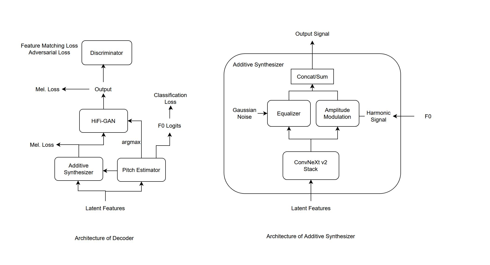

# 技術的な詳細
このドキュメントは、本リポジトリの技術的な詳細を記す。

## 開発の動機
- オープンソースのTTS(Text-To-Speech), SVS(Singing-Voice-Synthesis), SVC(Singing-Voice-Conversion)ができるモデルが欲しい。  
- なるべくライセンスが緩いものがいい。(MITライセンスなど)
- 日本語の事前学習モデルが欲しい。

## モデルアーキテクチャ
VITSをベースに改造するという形になる。  
具体的には、
- DecoderをDSP+HnNSF-HiFiGANに変更
- Text Encoderに言語モデルの特徴量を参照する機能をつけ、感情などを読み取れるように。
- Feature Retrievalを追加し話者の再現性を向上させる  
等の改造があげられる。

### 全体の構造

VITSの構造とほぼ同じ。

### デコーダー

DDSPのような加算シンセサイザによる音声合成の後にHiFi-GANに似た構造のフィルターをかけるハイブリッド構造。  
ピッチ情報を外部から与えることで、ピッチを制御することも可能。  
音素列、Duration、ピッチを外部から与えることで、歌声生成を可能にする。  